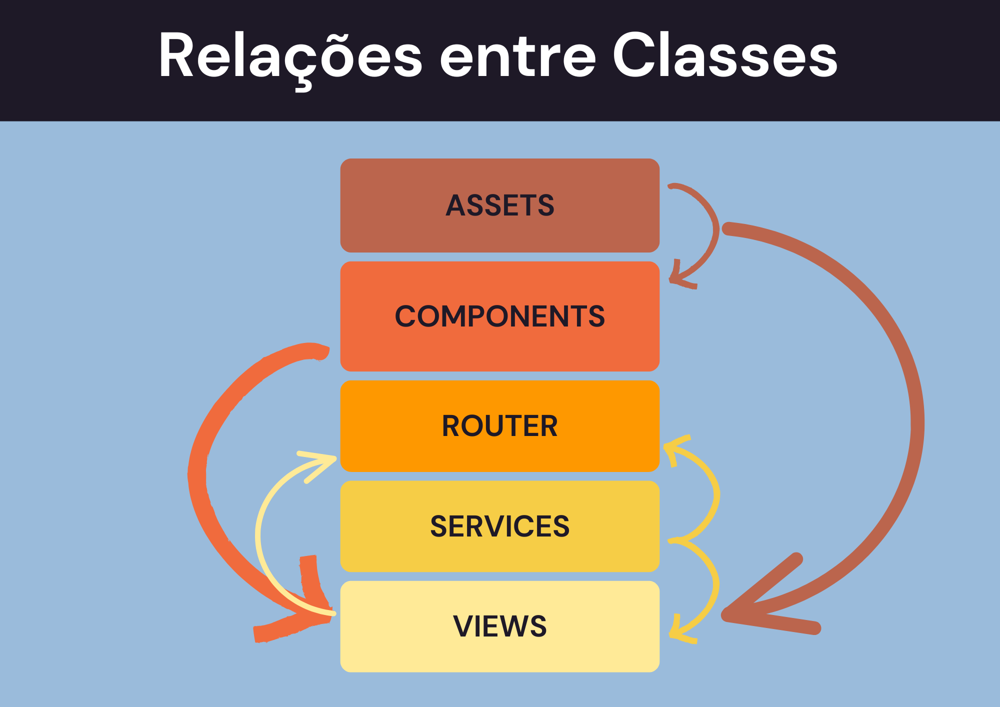

# Descrição e Relações entre camadas e pastas

### 1. Camada de Apresentação (Views e Componentes)

- **Pasta `src/views/`**: Contém as views principais da aplicação.
  - **`Dashboard.vue`**: View do dashboard que exibe gráficos e informações resumidas.
  - **`HomeView.vue`**: View da página inicial.
  - **Subpastas `Itens/`, `Temas/`, `alugueis/`**: Contêm views específicas para gerenciamento de itens, temas e aluguéis, respectivamente.
  - **Subpasta `Dashboard/`**: Contém componentes específicos do dashboard.

- **Pasta `src/components/`**: Contém componentes Vue reutilizáveis.
  - **`Nav.vue`**: Componente de navegação.

### 2. Camada de Serviços (API)

- **Pasta `src/services/`**: Contém serviços para comunicação com APIs.
  - **`api.js`**: Configuração e métodos para chamadas de API usando Axios.

### 3. Camada de Roteamento

- **Pasta `src/router/`**: Configuração das rotas da aplicação.
  - **`index.js`**: Define as rotas e os componentes associados.

### 4. Camada de Recursos Estáticos

- **Pasta `src/assets/`**: Contém arquivos CSS e outros recursos estáticos.
  - **`base.css`**: Estilos base da aplicação.
  - **`main.css`**: Estilos principais da aplicação.

### 5. Arquivos de Configuração

- **`vite.config.js`**: Configuração do Vite.
- **`eslint.config.mjs`**: Configuração do ESLint.
- **`package.json`**: Dependências e scripts do projeto.
- **`index.html`**: Arquivo HTML principal.

## Dependências entre Pacotes e Pastas

- **`src/main.js`**: Ponto de entrada da aplicação. Importa o `App.vue`, configura o roteador e monta a aplicação.
- **`src/App.vue`**: Componente raiz que inclui o `RouterView` para renderizar as views com base nas rotas.
- **`src/router/index.js`**: Define as rotas e importa as views correspondentes.
- **`src/services/api.js`**: Utilizado pelas views e componentes para fazer chamadas à API.
- **`src/views/Dashboard.vue`**: Importa e utiliza componentes `DoughnutChart` e `BarChart` de `dashboard.vue` e `barras.vue`.
- **`src/views/Itens/FormItens.vue`**: Importa e utiliza o serviço `api.js` para operações CRUD.
- **`src/views/Temas/FormTemas.vue`**: Importa e utiliza o serviço `api.js` para operações CRUD.
- **`src/views/alugueis/Alugueis.vue`**: Importa e utiliza o serviço `api.js` para operações CRUD.
- **`src/components/Nav.vue`**: Utilizado em várias views para navegação.

## Relações Entre as Camadas

1. **assets -> components, views**
   - Arquivos de estilo em `assets` são utilizados por componentes e views para aplicar estilos.

2. **components -> views**
   - Componentes são utilizados dentro das views para construir a interface do usuário.

3. **router ->**
   - O `router` não depende diretamente de outras camadas, mas define as rotas que mapeiam URLs para views específicas.

4. **services -> router, views**
   - Serviços são utilizados pelas views para fazer chamadas à API e podem ser utilizados pelo router para proteger rotas ou carregar dados.

5. **views -> router**
   - Views são mapeadas pelo router para serem exibidas com base nas rotas definidas.

## Resumo das Relações

- **assets -> components, views**
- **components -> views**
- **router ->**
- **services -> router, views**
- **views -> router**